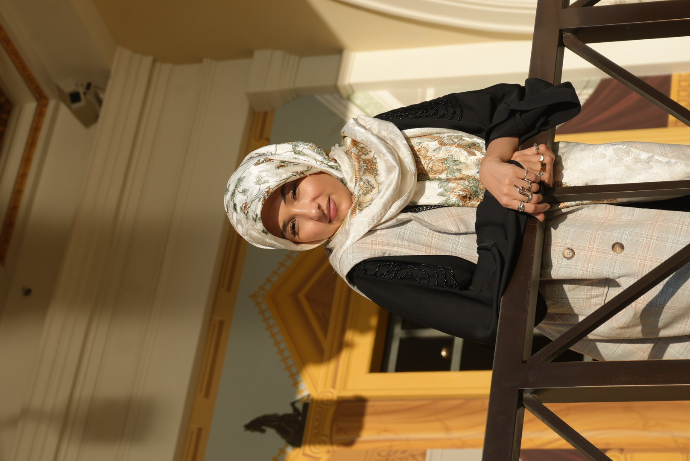
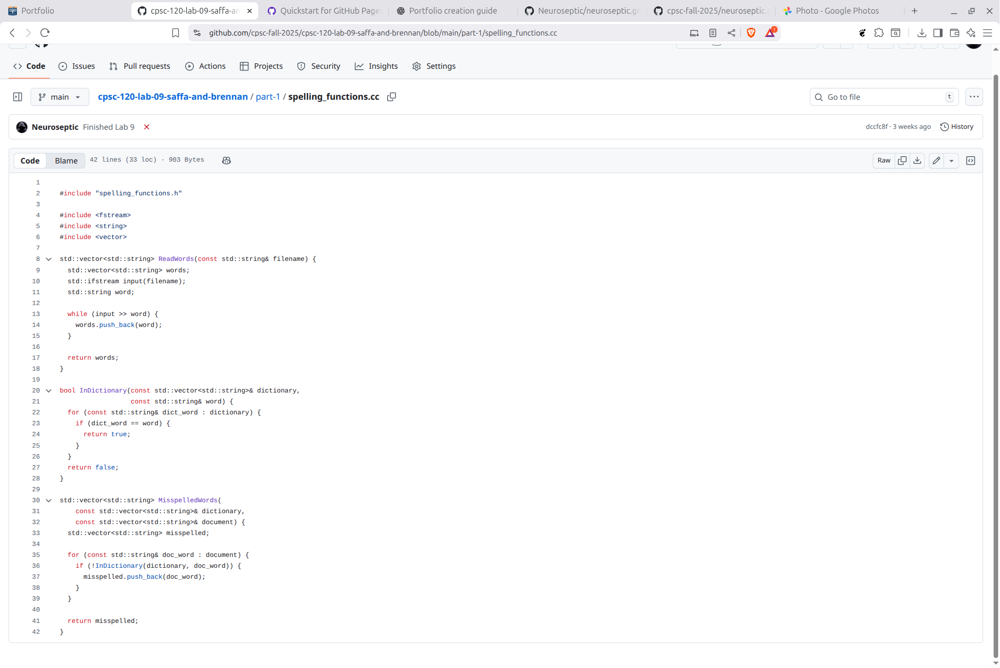
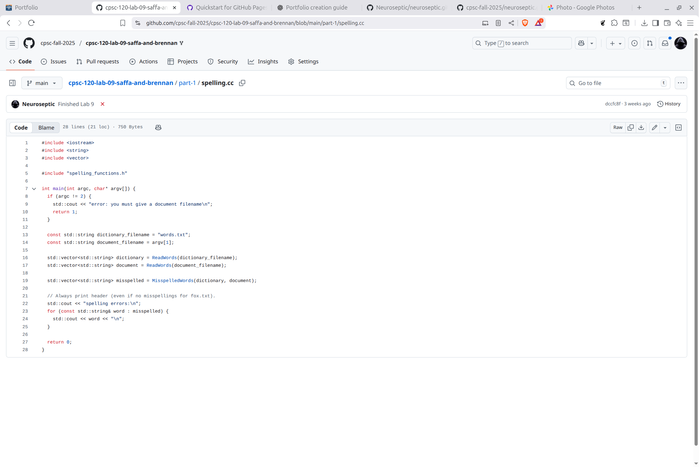
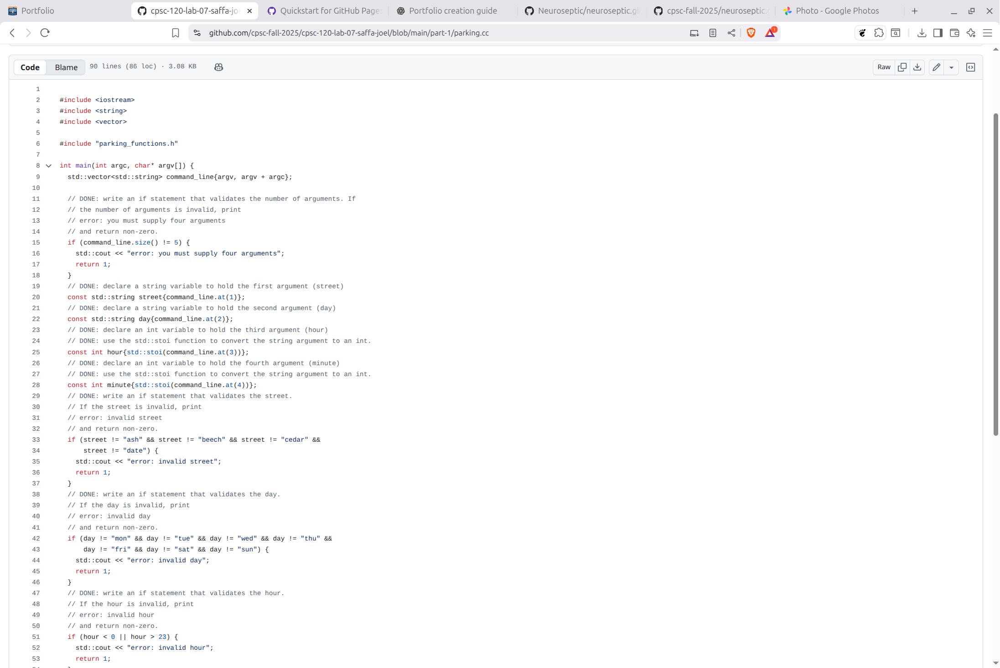
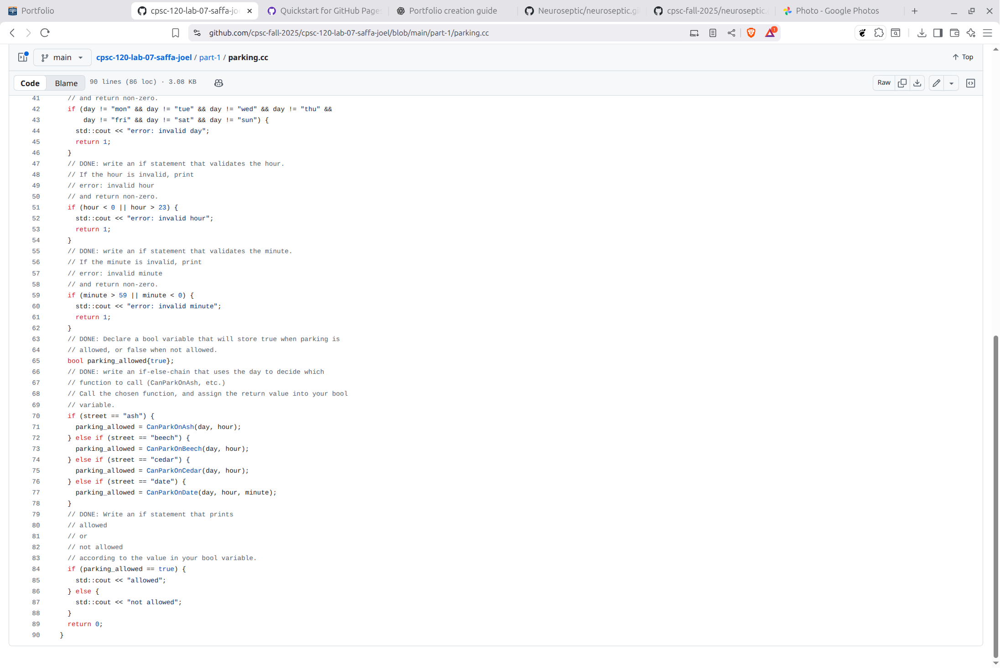
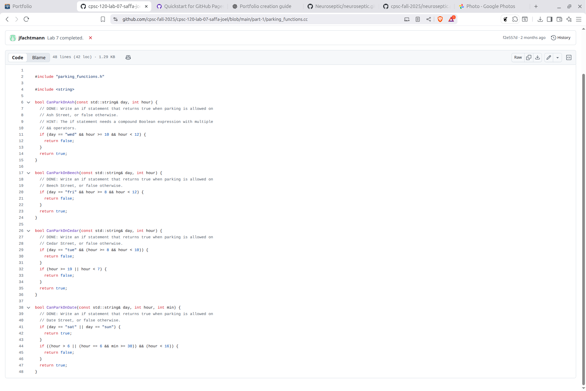
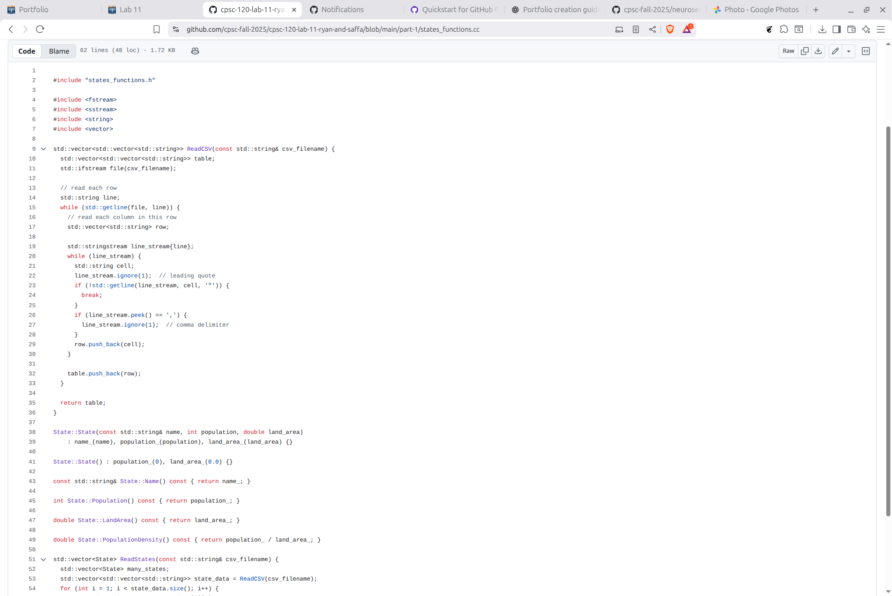
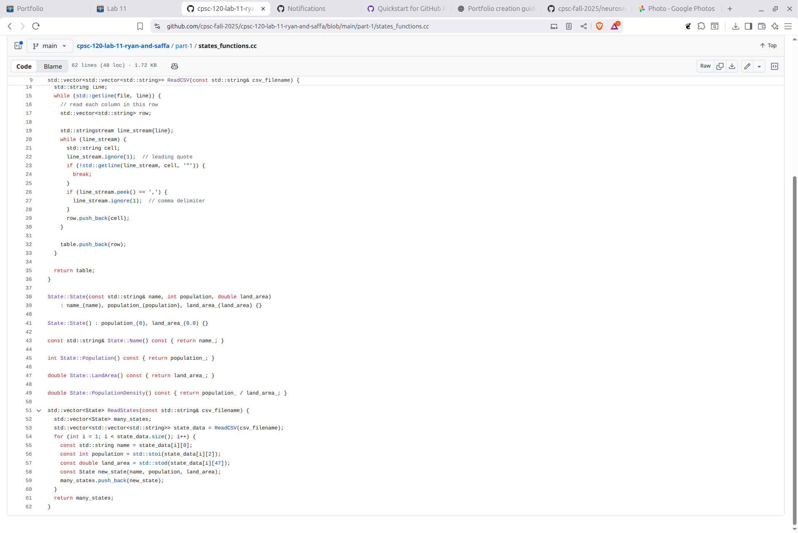

# Saffa Nahi's Portfolio

This is my home page! My name is Saffa Amjad Nahi and I am a student at Cal State Fullerton. 
I am majoring in Electrical Engineering with a double major in Premed.

My GitHub page is [neuroseptic](https://github.com/neuroseptic).

## Favorite CPSC 120L Labs

### 1. Lab 9, Part 1

Lab 9, part 1 was one of my favorite labs because it introduced vectors, file reading, and input validation in a simple but practical way. I enjoyed building a small spell-checker that compared words between two files to find misspellings. I learned how important it is to check for valid filenames and handle user input correctly. This lab helped me feel more confident working with loops, vectors, and basic file processing in C++.

### 2. Lab 7, Part 1

Lab 7, part 1 stood out to me because it took real street-parking rules and turned them into conditional logic. I liked figuring out how the day, hour, and street name all had to be checked before giving a result. This assignment helped me practice command-line arguments, converting strings to numbers, and writing clear if-else statements. It showed me how programming can model everyday decision-making.

### 3. Lab 11, Part 1

Lab 11, part 1 became another one of my favorites because it helped me understand how classes and objects work in C++. I learned how header files and source files work together and how functions connect to the data stored inside a class. It was rewarding to see the CSV file load correctly once everything was written properly. This lab helped me understand the basic structure of object-oriented programming.

